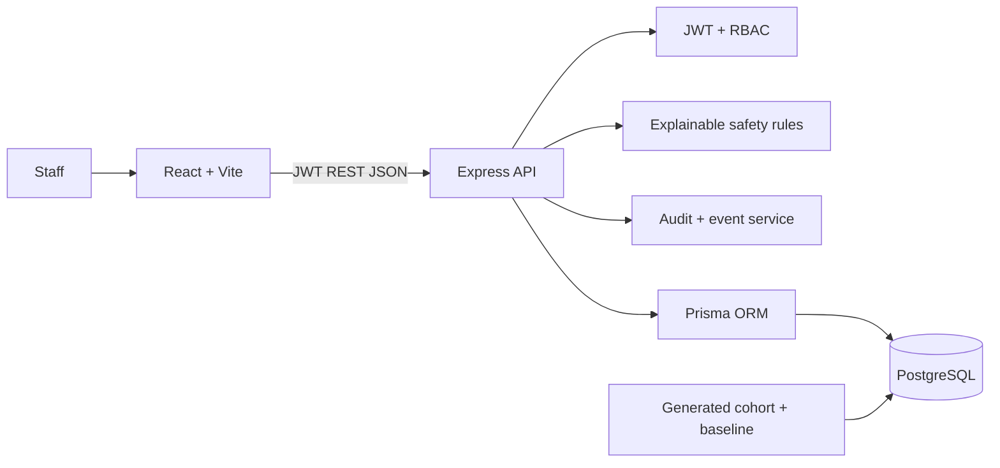
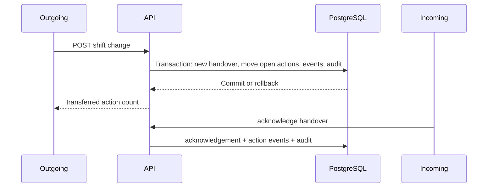

# Architecture

The React/Vite UI calls the Express REST API. The API validates request data with Zod, authenticates JWTs, enforces per-role permissions, runs transactions for related safety updates, and persists through Prisma to PostgreSQL. Safety rules are deterministic and return human-readable reasons. Audit entries capture changes; events capture workflow chronology. Metrics read stored actions or the reproducible generated experiment.

Integration stub: REST is the boundary for future external scheduling/identity integrations. No external clinical system is connected. Deployment requires security, privacy, safety, usability, workflow and regulatory review; this academic prototype is not validated for care.
